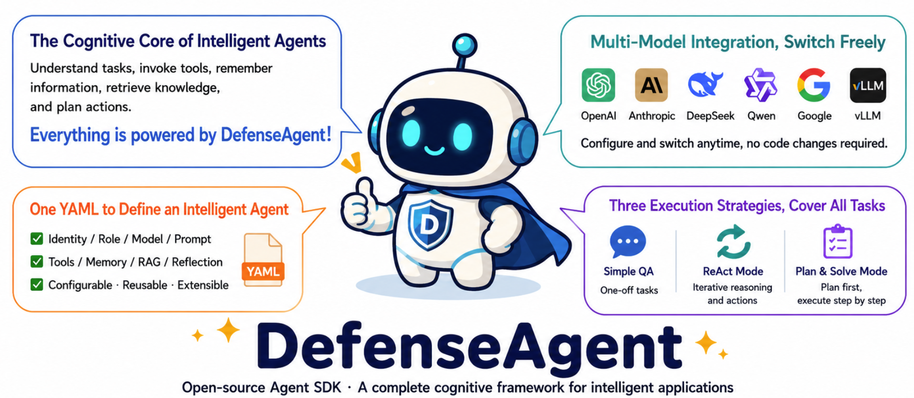

<p align="center">
  
</p>

<div align="center">

We appreciate your support! Help us grow and improve by giving DefenseAgent a 🌟 star on GitHub!

[English](README.md) · [中文 README](README_zh.md)

[](https://pypi.org/project/defense-agent/)
[](https://pypi.org/project/defense-agent/)
[](LICENSE)

</div>

---

## ✨ Highlights

- 🧾 **One-file agent definition** — Identity, LLM, tools, memory, RAG, prompt — all in one strictly-validated YAML. Unknown fields fail loudly at load (`extra="forbid"`).
- 🔌 **Provider-agnostic** — `openai`, `anthropic`, `deepseek`, `qwen`, `google`, `vllm`. Swap providers via `.env`, no code change.
- 🎯 **Three execution strategies** — `SimpleAgent` (one-shot), `ReActAgent` (tool loop), `PlanAndSolveAgent` (plan→execute→synthesise). All from the same `AgentConfig`.
- 🧠 **Tier-aware memory (0.2.0)** — Four lifecycle tiers (Working / Episodic / Semantic / Procedural), hybrid scoring (similarity × recency × importance × frequency), optional background consolidation.
- 🛠️ **Three tool sources, one registry** — Local skill bundles (`SKILL.md`), MCP servers (stdio / SSE / WebSocket / streamable-http), Python callables (by file path or dotted module).
- 🖼️ **Optional RAG + vision** — Drop documents in for a `rag_search` tool; pass `images=[…]` for multimodal turns. Disabled by default — you only pay when you use them.

## 🎬 Application Showcase

### SEU Agent Town

DefenseAgent is used as the cognitive core of **SEU Agent Town**, where town agents rely on DefenseAgent for model orchestration, tool use, memory, knowledge retrieval, planning and execution.

<p align="center">
  
</p>

## Introduction

DefenseAgent is a Python harness for single-agent LLM applications. Describe your agent in one strictly-validated YAML profile — identity, LLM provider, tools, memory, RAG, prompts — then instantiate it with one line and run tasks against any of three execution strategies.

```python
from DefenseAgent.agent import AgentConfig, ReActAgent
from DefenseAgent.examples import EXAMPLE_PROFILE_PATH

agent = ReActAgent(AgentConfig(profile=EXAMPLE_PROFILE_PATH))
result = await agent.run("Summarise today's plan in one sentence.")
```

## Install

```bash
pip install 'defense-agent[memory]'    # recommended — default config needs this
```

| Extra | What you get |
|---|---|
| `defense-agent` | Core only (must pass `use_memory=False`) |
| `defense-agent[memory]` | `mem0ai[nlp]` + `fastembed` — persistent memory + `memory_recall` tool |
| `defense-agent[rag]` | `llama-index` + extractors — RAG + `rag_search` tool |
| `defense-agent[mcp]` | `mcp` — connect to MCP tool servers |
| `defense-agent[all]` | memory + rag + mcp |
| `defense-agent[dev]` | `pytest` + `pytest-asyncio` for the test suite |

Requires **Python ≥ 3.10**. Plan ~1 GB on first install (core pulls `torch` transitively via `ms-agent`).

## Quickstart

```bash
mkdir myagent && cd myagent
python -m venv .venv && source .venv/bin/activate
pip install 'defense-agent[all]'
```

Drop your provider credentials into `.env`:

```bash
AGENT_LAB_LLM_PROVIDER=deepseek
DEEPSEEK_API_KEY=sk-…
DEEPSEEK_MODEL=deepseek-chat
DEEPSEEK_BASE_URL=https://api.deepseek.com/v1

# Only when using memory_recall / rag_search:
EMBEDDING_API_KEY=sk-…
EMBEDDING_BASE_URL=https://api.openai.com/v1
EMBEDDING_MODEL=text-embedding-3-small
EMBEDDING_DIMS=1536
```

Run the bundled example profile:

```python
# run_example.py
import asyncio
from DefenseAgent.agent import AgentConfig, ReActAgent
from DefenseAgent.examples import EXAMPLE_PROFILE_PATH

async def main():
    async with ReActAgent(AgentConfig(profile=EXAMPLE_PROFILE_PATH)) as agent:
        result = await agent.run("Summarise today's plan in one sentence.")
        print(result.final_answer)

asyncio.run(main())
```

Copy the bundled profile out and start editing:

```bash
python -c "from DefenseAgent.examples import EXAMPLE_AGENT_DIR; import shutil; shutil.copytree(EXAMPLE_AGENT_DIR, './my_profile')"
```

For the full profile schema, see [`docs/configuration.md`](docs/configuration.md).

## Architecture

```
AgentConfig ── profile.yaml + .env
     │
     ▼
build_components_sync ── LLM, Memory, ToolRegistry, Reflector, Compressor, Logger
     │
     ▼
BaseAgent ◀──── ReActAgent | SimpleAgent | PlanAndSolveAgent
     │
     ▼
run(task) ──► AgentResult { final_answer, steps[], usage }
```

`build_components_sync` runs synchronously. MCP server connections and the RAG index are built lazily on the first `run()`. Memory, MCP, skills and RAG inherit from [ms-agent](https://github.com/modelscope/ms-agent)'s upstream classes — DefenseAgent adds the tier-aware orchestrator, RAG extractors, profile bridging, and the unified agent loop on top.

## Memory tiers (since 0.2.0)

DefenseAgent's memory module is a four-layer architecture inspired by Hello-Agents, on top of mem0 + Qdrant for the persistent tiers. All writes go through one `MemoryOrchestrator` facade — the agent picks the tier; reads default to hybrid scoring across tiers.

```
                  MemoryOrchestrator
                          │
        ┌─────────┬───────┴──────┬──────────────┐
        ▼         ▼              ▼              ▼
    WORKING   EPISODIC       SEMANTIC      PROCEDURAL
    (in-mem)  (trajectories) (reflections) (SOPs / patterns)
        │         │              │              │
        │         └────────┬─────┴──────────────┘
        │                  ▼
        │            mem0 + Qdrant
        │
        └─►  MemoryConsolidator (opt-in background promotion)
```

| Tier | Storage | Typical content |
|------|---------|----------------|
| **Working** | in-memory deque, TTL + FIFO | Current-session scratchpad |
| **Episodic** | Qdrant (`tier=episodic`) | Raw events, agent traces |
| **Semantic** | Qdrant (`tier=semantic`) | Distilled facts, reflections, lessons |
| **Procedural** | Qdrant (`tier=procedural`) | SOPs, attack patterns, workflows |

LLMs reach memory through the auto-registered `memory_recall` tool. For internals (hybrid scoring formula, consolidation lifecycle, working-memory eviction policy), see [`docs/memory.md`](docs/memory.md).

## Documentation

| Doc | What's inside |
|-----|---------------|
| [`docs/configuration.md`](docs/configuration.md) | Full `profile.yaml` schema — identity, cognitive, prompt, RAG knobs, per-field fallback rules, validation failure modes |
| [`docs/providers.md`](docs/providers.md) | LLM provider table, embedding pairings, per-provider notes, programmatic LLM injection, multimodal / vision setup |
| [`docs/tools.md`](docs/tools.md) | Tool sources — local skill bundles, MCP servers, Python entry points, built-in tools the LLM always sees |
| [`docs/memory.md`](docs/memory.md) | Tier-aware memory module — `MemoryOrchestrator` API, scoring weights, lifecycle consolidation, working-memory semantics |
| [`docs/architecture.md`](docs/architecture.md) | Module layout, agent classes + `AgentResult` shape, customization & dependency injection, local development |

## Develop locally

```bash
git clone https://github.com/yishu031031/DefenseAgent.git
cd DefenseAgent
python -m venv .venv && source .venv/bin/activate
pip install -e '.[all,dev]'
pytest
```

The test suite is fully offline (no network or external services). For backend smoke tests against real Ollama + Qdrant, see [`scripts/smoke_real_backend.py`](scripts/smoke_real_backend.py).

## License

MIT.
